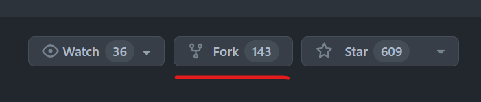

# Team Profile Generator


## Description

This command-line application has been created to allow a manager to generate a webpage that displays their team's basic info so that they have quick access to their team's emails and GitHub profiles.

Using Node.js and the fs & inquirer NPM dependencies, this CLI application will take user input to produce a fully complete team.html file that displays the team's details. 

Unit testing has been created for this application which can be run with Jest.

## Table of Contents 

* [Installation](#installation)
* [Usage](#usage)
* [License](#license)
* [Tests](#tests)
* [Technical Skills](#technical-skills-used-in-this-project)

## Installation

1. Fork the repository by clicking the Fork button:

    

2. Open the repository in VS Code.

3. Ensure you have node.js installed on your computer. To check open the Windows Command Prompt, Powershell or a similar command line tool, and type:
    ``` 
    node -v
    ```
    If you have node.js installed it will print a version number (e.g. v0. 10.35). Otherwise, go to [nodejs.org](https://nodejs.org/en) and download it (it is recommended to download the LTS version).

## Usage 

1. Open the repository in VS Code and right click on the index.js file and select 'Open in Integrated Terminal'.

2. In the terminal, run the command:

    ```
    node index.js
    ```

3. A series of questions about your team will be presented in the terminal. Please type your answer to each question in the terminal and press enter. When presented with a list of choices, use the up & down arrows to select an option and then press enter to select it. 

> [!NOTE]
> If you do not provide an answer, you'll be prompted to provide this. The application will not progress until an answer is provided.
> When adding in an email, if you provide an invalid email address, you'll be prompted to enter a valid email address.

4. Initially, you'll need to add the details of the manager of the team, after which you'll be asked which type of team member you would like to add:
    * Engineer
    * Intern
    * I don't want to add any more team members

    If you select `Engineer` or `Intern`, a new series of questions will be presented to obtain the relevant information for that team member and you'll return to the same question to allow you to continue to add several team members.

5. Once you have completed adding all your team members, select `I don't want to add any more team members` to create your team.html file. You'll see a success comment in the terminal and a team.html file will have been created in the output folder. 


> [!CAUTION]
> If you run the 'node index.js' command again in the integrated terminal, it will overwrite any current team.html file that may already exist in the output folder.

### This video provides a walkthrough of how to use the application:

## License 

This application is covered under the MIT license. Please see the [LICENSE](./LICENSE) file in the repository for the full details of this license.

## Tests

Tests can be run using Jest by typing the following in the command-line:

```
    npm test 
```

## Technical skills used in this project


